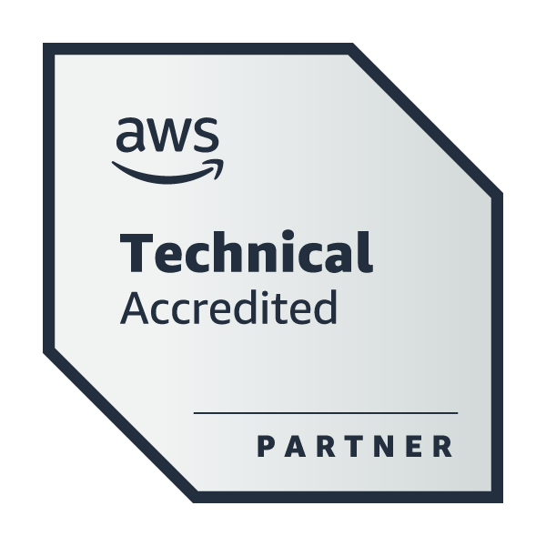
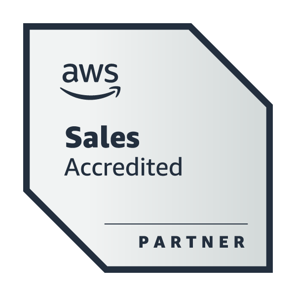
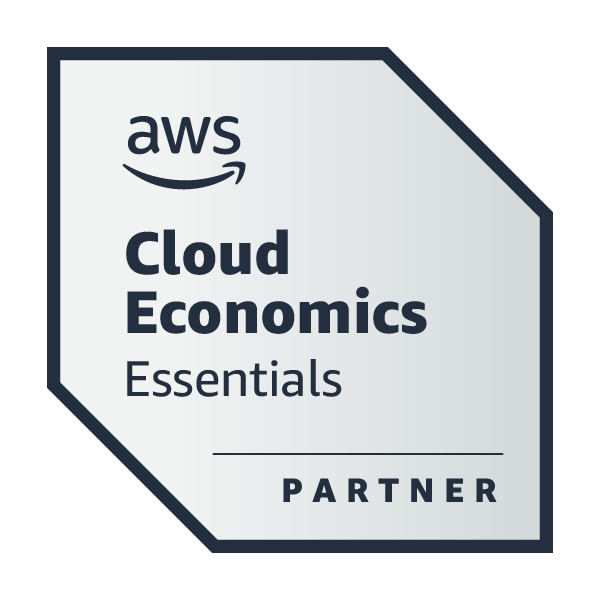
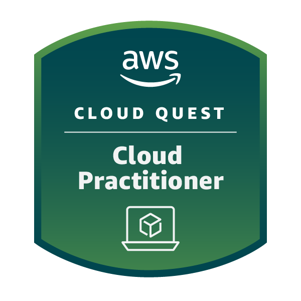
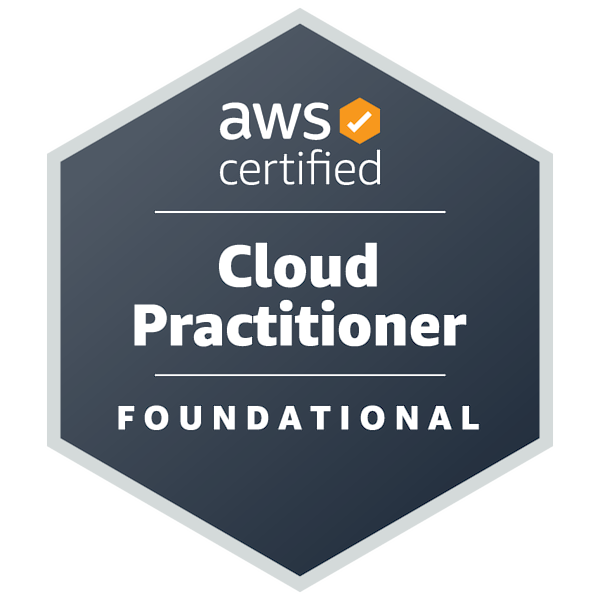

  

  
  
    
     
  

   

## 🚀 **Linguagens e Frameworks**:

#### 🌱 Estou aprendendo todos os dias:

## **Um pouco sobre mim**

* Olá! Pode me chamar de Alex. Sou um desenvolvedor em formação, apaixonado por Desenvolvimento de Sistemas e Arquitetura de Software.  
* Atualmente, estou aprofundando meus conhecimentos em engenharia de software, arquitetura de sistemas, boas práticas de desenvolvimento, design de soluções e tecnologias modernas.  
* Tenho estudado e desenvolvido projetos utilizando Python, Java, Docker, bancos de dados SQL, APIs, Git, AWS e outras ferramentas do ecossistema de desenvolvimento.  
* Acredito que construir software vai além de escrever código: envolve criar soluções escaláveis, bem estruturadas e que gerem valor para as pessoas.  
* Gosto muito de aprender, compartilhar conhecimento e ensinar, porque acredito que ensinar é uma das melhores formas de aprender. Também gosto de conhecer novas pessoas e trocar experiências sobre tecnologia, arquitetura de sistemas, programação, estudos, games e esportes. Fique à vontade para entrar em contato!

 

## 🏆 Certificações

Abaixo estão algumas certificações que demonstram meu comprometimento constante com o aprendizado, a evolução profissional e o aprofundamento em conhecimentos técnicos.

  
  
  
  
  

## Vamos nos conectar?

<!--  -->

